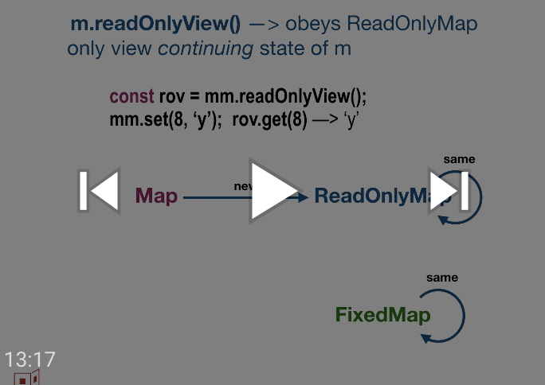

# proposal-readonly-collections

## `snapshot`,`diverge`,`readOnlyView` methods for all collections

by Mark S. Miller (@erights) and Peter Hoddie (@phoddie)

## Status

Presented to TC39 (Javascript standards committee), achieving stage 1.

[](https://www.youtube.com/watch?v=N-X_4Xe9lEw&list=PLzDw4TTug5O0ywHrOz4VevVTYr6Kj_KtW)

[Slides](https://github.com/tc39/agendas/blob/master/2019/10.readonly-collections-as-recorded.pdf)

## Proposal

Currently JavaScript collections are unconditionally mutable. However, many use cases could benefit from separating the ability to query a collection from the ability to mutate it. Indeed, we have seen repeated calls for such support. To minimize cognitive load of new API, we propose the addition of only three new methods to all collections, and the addition of new collection classes whose APIs are only a subset of the existing collection abstractions. We propose these apply to all EcmaScript enumerable collections, i.e., all EcmaScript collections except `WeakMap` and `WeakSet`. We illustrate the general case using `Map` as a concrete example. For brevity, we refer to class-like constructors, such as `Map`, as if they are classes.

Where currently we have one `Map` class that represents the mutable variant, we would add a `FixedMap` and a `ReadOnlyMap`. We add these classes as static members of the `Map` class to avoid polluting the global name space. All three of these classes would support the `snapshot`, `diverge`, and `readOnlyView` methods proposed here. In addition, `FixedMap` and `ReadOnlyMap` would support the query-only methods of `Map` but not any of the methods that would mutate a map. They have precisely the same API but different behavioral contracts.

Following the Liskov substitutability principle, we consider a type to be a behavioral contract. Type B is a behavioral subtype of type A when instances of B obey A's specification of the behavior of A instances. By these criteria `Map`, `FixedMap`, and `ReadOnlyMap` are behavioral subtypes of a hypothetical `AbstractMap`, which again has exactly the API of `FixedMap` and `ReadOnlyMap`, but a weaker behavioral type that `Map` also obeys. In addition, `FixedMap` is a behavioral subtype of `ReadOnlyMap` At this time, we do not propose actually creating this abstract supertype `AbstractMap`, but rather treat it as a specification fiction.

The types in the API definitions below are stated according to these behavioral subtyping relationships.

## APIs

```js
class AbstractMap {

        // A FixedMap, not necessarily fresh, whose state is this map's current
        // state.
        snapshot() :FixedMap;

        // A fresh Map whose initial state is this map's current state.
        diverge() :Map;

        // A ReadOnlyMap, not necessarily fresh, whose state is a read only
        // view of this map's current state.
        readOnlyView() :ReadOnlyMap();

        // query-only methods of Map
        ...
}

class Map obeys AbstractMap {

        // methods of AbstractMap
        ...

        snapshot() :FixedMap;  // necessarily fresh

        readOnlyView() :ReadOnlyMap();  // necessarily fresh

        // also the mutating methods of Map
        ...
}

// An instance of a ReadOnlyMap provides only the ability to query, not update.
class ReadOnlyMap obeys AbstractMap {

        readOnlyView() :ReadOnly;  // returns itself
}

// The contents of this map cannot change.
class FixedMap obeys ReadOnlyMap {

        snapshot() :FixedMap;  // returns itself

        readOnlyView() :ReadOnly;  // returns itself
}

```

On a suitable implementation such as [Moddable's XS](https://github.com/Moddable-OpenSource/moddable), the "\*Fixed" versions of these collections can often be placed in ROM. This is especially valuable for data collections such as `ArrayBuffer`.

## Shim

[Readonly Collections Shim](https://github.com/Agoric/readonly-collections-shim) is a start on a shim of this proposal.

# Related

This proposal is based on experience with E's [collection classes](http://erights.org/elang/collect/tables.html).
